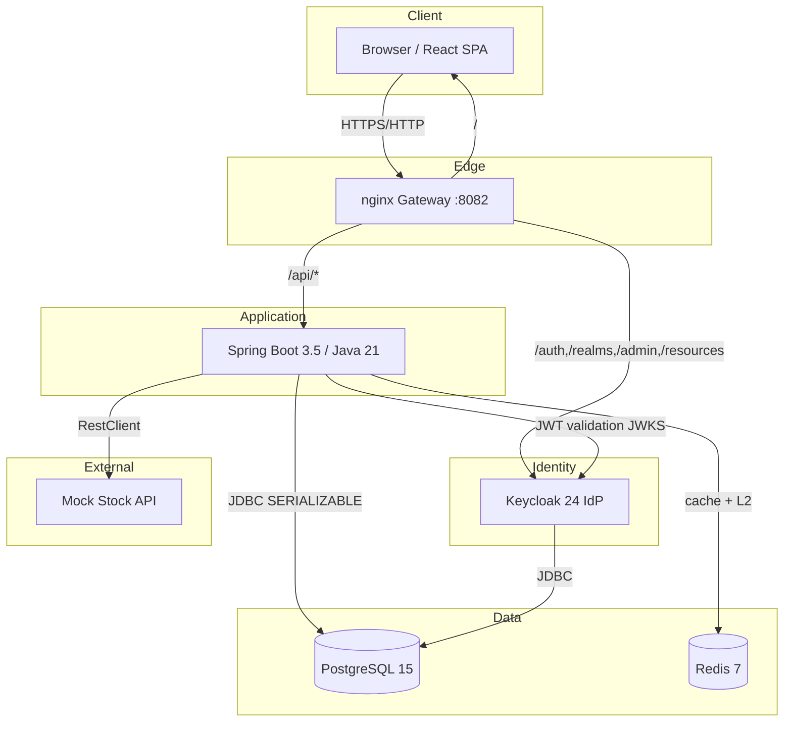
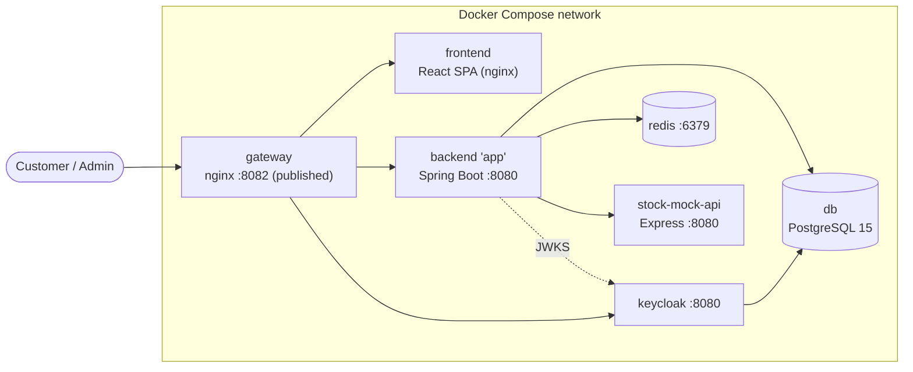
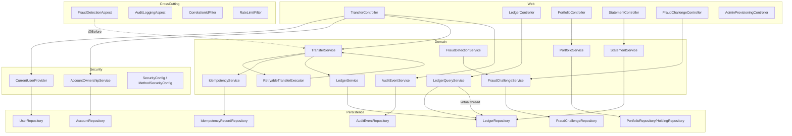
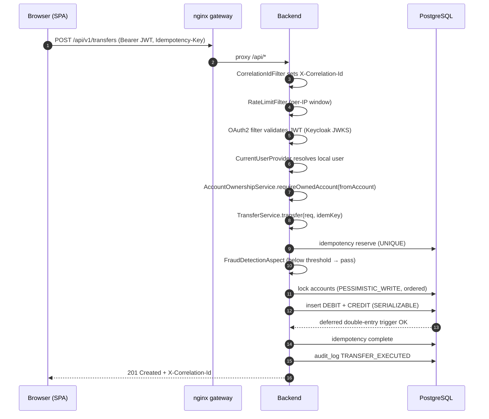
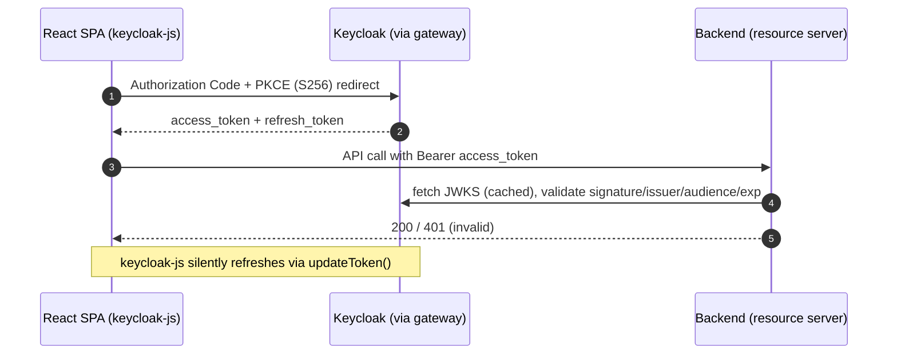
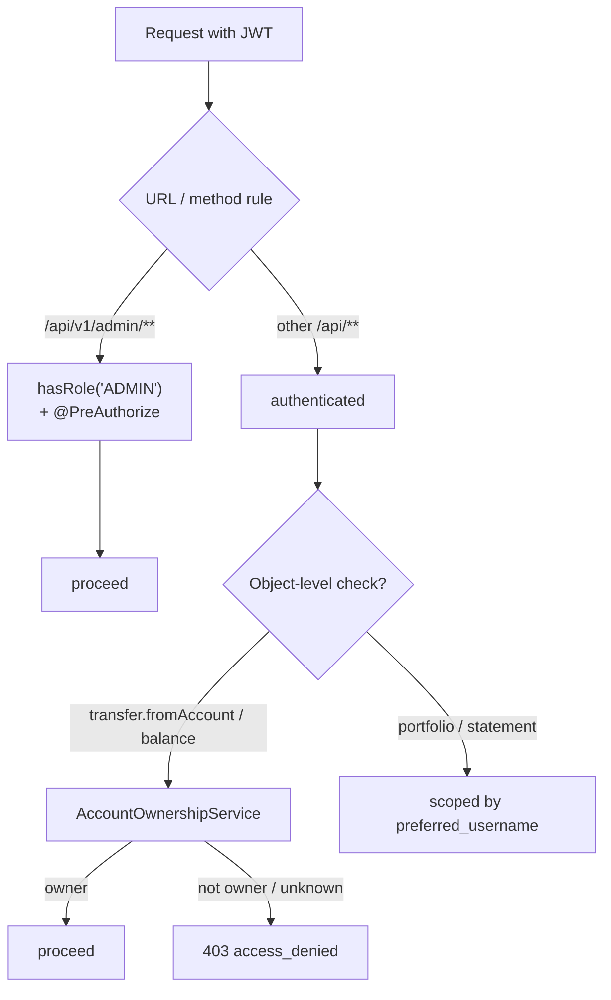
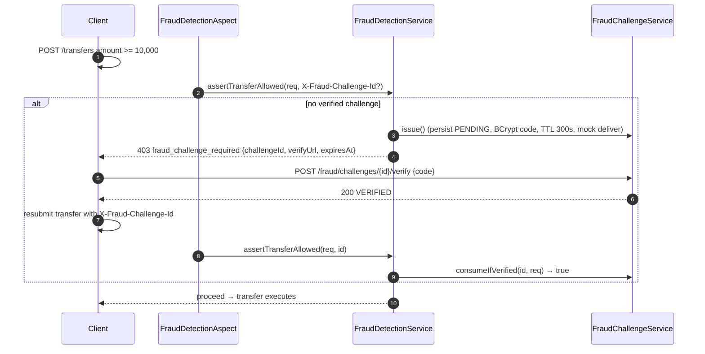
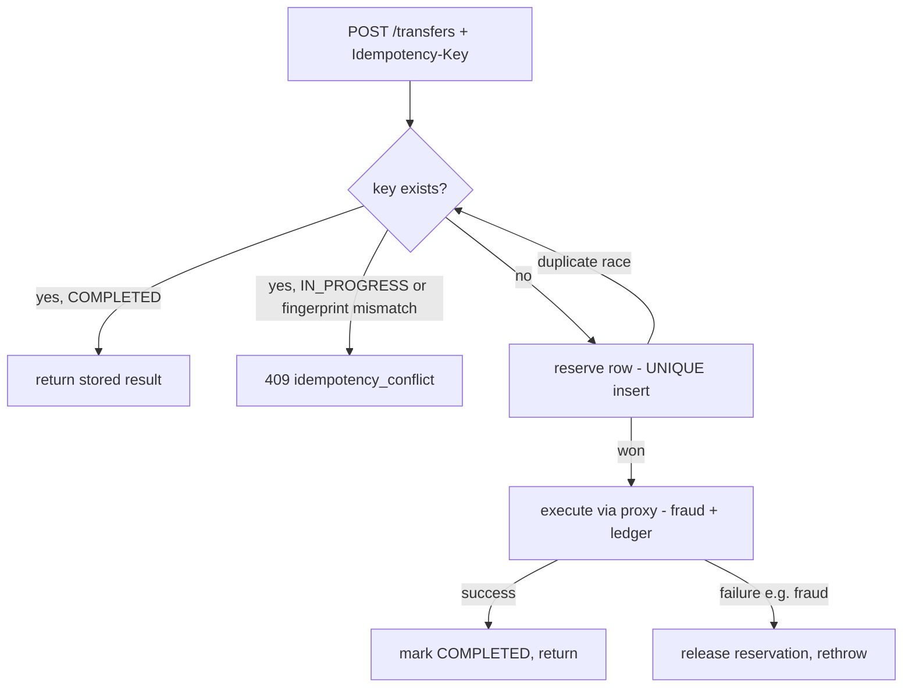
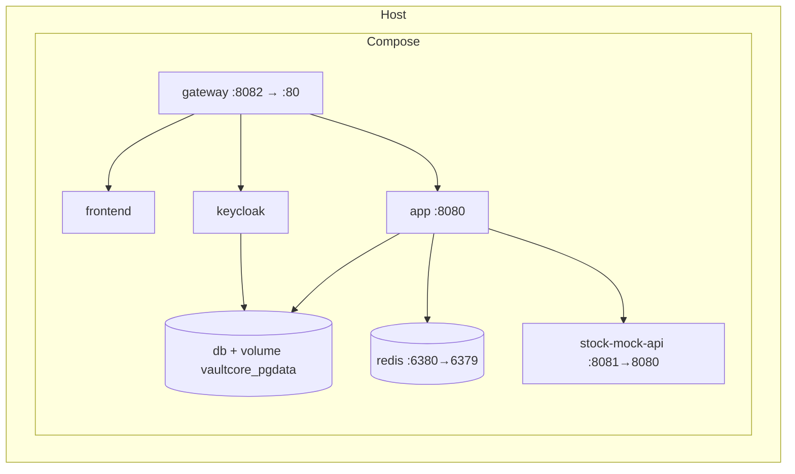

# VaultCore Financial — Enterprise Architecture

> Project 1 (FinTech) — *Secure Digital Banking & Trading Core*, per the Zaalima Development
> "Q4 High-Performance Java" specification. This document describes the **current implementation**
> in this repository, not an aspirational design. Where the implementation deviates from the original
> specification, the deviation and its rationale are called out explicitly.

---

## 1. Executive Summary

VaultCore Financial is a monolithic, cloud-native digital-banking core that implements the three
"deep production" features mandated by the specification:

1. A **double-entry, immutable ledger** with ACID guarantees and serialized money movement.
2. A **virtual-thread-backed "Get Balance"** read path (Java 21 / Project Loom).
3. **Fraud-detection middleware** (Spring AOP) that triggers a mock 2FA challenge above a
   configurable threshold, with a full challenge → verify → resubmit completion flow.

On top of these, the system adds enterprise controls that a production bank requires: externalized
authentication via **Keycloak (OAuth2/OIDC)**, **object-level authorization** (ownership / IDOR
prevention), **idempotent** money movement, a **durable audit trail** with correlation IDs,
**rate limiting**, and a hardened, health-gated **Docker Compose** deployment fronted by an
**nginx gateway**.

The system has been runtime-verified: the full stack starts under `docker compose up`, 35 automated
tests pass against Testcontainers PostgreSQL, an OWASP ZAP baseline scan reports **0 High / 0 Critical**,
and the critical security controls (IDOR 403, RBAC 403, JWT signature validation) were proven against
the live API with a real Keycloak-issued token.

---

## 2. Business Context

| Aspect | Description |
|---|---|
| **Product** | "VaultCore Financial" — a Neo-Bank core: account management, money transfers, simulated stock trading. |
| **Primary risk** | Per the specification, a breach via SQL Injection / XSS / broken access control is treated as a legal/regulatory failure. Security is the highest-priority non-functional requirement. |
| **Core invariant** | Money is never created or destroyed: every transfer is a balanced debit + credit pair recorded in an immutable ledger. |
| **Regulatory posture** | Immutable ledger + durable audit trail + correlation IDs provide the traceability expected of a regulated financial system. |
| **Users** | Customers (own accounts, transfer, trade, download statements) and Administrators (provision users/accounts). |

---

## 3. System Overview

VaultCore is a **single Spring Boot service** (correct for Project 1, which is explicitly a banking
*core*, not a microservices project) organized by business capability, fronted by an nginx gateway
that unifies the SPA, the API, and the identity provider under one origin.

---

## 4. Architecture Goals

| Goal | How it is met in the implementation |
|---|---|
| **Correctness of money movement** | Double-entry ledger + DB triggers + `SERIALIZABLE` isolation + pessimistic locks + retry. |
| **Security-first** | OAuth2 resource server, object-level ownership checks, RBAC, BCrypt, CSRF-off stateless bearer API, CORS, security headers, rate limiting. |
| **Massive read concurrency** | Java 21 virtual threads on the balance read path. |
| **Idempotent, replay-safe operations** | `Idempotency-Key` with a reserve-before-execute pattern backed by a UNIQUE constraint. |
| **Traceability / auditability** | Immutable ledger, `audit_log` table, per-request correlation IDs. |
| **Deployability** | One-command `docker compose up`; health-gated startup ordering; single public entry point. |
| **Testability** | Testcontainers integration tests + Mockito unit tests + MockMvc security tests; CI. |

---

## 5. Technology Stack

| Layer | Technology | Version | Notes |
|---|---|---|---|
| Language / Runtime | Java | 21 (LTS) | Virtual Threads enabled |
| Backend framework | Spring Boot | 3.5.10 | exceeds spec's 3.3 floor |
| Security | Spring Security 6 / OAuth2 Resource Server | — | validates Keycloak JWTs |
| Identity Provider | Keycloak | 24.0.5 | realm `vaultcore`, separate DB |
| ORM | Hibernate 6 / Spring Data JPA | — | DTO projections, L2 cache region |
| Migrations | Flyway | V1–V10 | |
| Database | PostgreSQL | 15 | ledger, users, accounts, portfolio, idempotency, fraud, audit |
| Cache / Rate infra | Redis | 7 (alpine) | Redisson L2 region factory + Spring cache |
| PDF | Apache PDFBox | 2.0.30 | monthly statements (multi-page) |
| AOP | `spring-boot-starter-aop` | — | audit + fraud aspects (proxy-based) |
| Frontend | React | 19 + Vite 7 | |
| Frontend state | **Zustand** | 5 | see §"Deviations" |
| Frontend auth | keycloak-js | 24 | PKCE S256, silent SSO |
| Frontend charts | Recharts | 2 | portfolio visualization |
| Gateway | nginx | 1.27-alpine | reverse proxy + security headers |
| Build | Maven (wrapper) | 3.9 | JaCoCo coverage |
| CI | GitHub Actions | — | build/test/coverage, Trivy, CodeQL |

---

## 6. High-Level Architecture (C4 – Container)

**Container responsibilities**

| Container | Image / Build | Responsibility | Health |
|---|---|---|---|
| `gateway` | `nginx:1.27-alpine` | Single public entry point (`:8082`); routes `/`, `/api/*`, Keycloak paths; adds SPA security headers | `wget 127.0.0.1/health.json` |
| `frontend` | local build (Vite → nginx) | Serves the React SPA | — |
| `app` (backend) | local build (multi-stage, non-root) | All business logic and REST API | `/actuator/health` |
| `keycloak` | `quay.io/keycloak/keycloak:24.0.5` | OAuth2/OIDC identity provider; realm import | TCP probe :8080 |
| `db` | `postgres:15` | Application + Keycloak databases (separate DBs) | `pg_isready` |
| `redis` | `redis:7-alpine` | Hibernate L2 region + Spring cache backing | `redis-cli ping` |
| `stock-mock-api` | local build (non-root) | Deterministic stock prices | — |

---

## 7. Component Diagram (Backend)

---

## 8. Request Flow (transfer, happy path)

---

## 9. Authentication Flow

Authentication is fully externalized to Keycloak. The backend is a **resource server** that validates
JWTs; it does **not** issue tokens.

- Decoder: `NimbusJwtDecoder` from `issuer-uri`, with issuer + optional audience + clock-skew validators
  (`SecurityConfig`).
- Roles: Keycloak `realm_access.roles` → `ROLE_*` authorities.
- **Refresh tokens** are handled by Keycloak / keycloak-js (`updateToken`). See §"Deviations".

---

## 10. Authorization Flow

Two layers, both enforced in all runtime profiles:

- **Function-level:** `@EnableMethodSecurity` + `@PreAuthorize("hasRole('ADMIN')")` on
  `AdminProvisioningController`, plus the URL rule `/api/v1/admin/** → hasRole('ADMIN')`.
- **Object-level (IDOR prevention):** `AccountOwnershipService.requireOwnedAccount` resolves the
  account by `(accountNumber, ownerId)`; a non-owner cannot distinguish "not found" from "not yours"
  (both → `403 access_denied`). Applied to transfer `fromAccount` and ledger balance.

---

## 11. Fraud Detection Flow

Threshold, channel, and TTL are configurable (`app.fraud.*`). Implemented as **Spring AOP**
(`@Aspect @Before` on `TransferService.transfer(request)`), satisfying the spec's "Spring Interceptor
or AOP" requirement.

---

## 12. Idempotency Flow

The reservation is inserted **before** execution; the UNIQUE index on `idempotency_key` is the
concurrency arbiter, so two simultaneous duplicates cannot both post. Recoverable failures release the
reservation so the client can legitimately retry (e.g. after a fraud challenge).

---

## 13. Deployment Architecture

Startup is **health-gated**: `keycloak` waits for `db` healthy; `app` waits for `db`, `keycloak`, and
`redis` healthy; `gateway`/`frontend` wait for `app`. This guarantees `docker compose up` converges to
a working stack. The backend and stock-mock containers run as **non-root**.

---

## 14. Scalability Considerations

| Concern | Current design | Scale path |
|---|---|---|
| Read throughput (balance) | Virtual-thread executor per request; L2/Spring cache on Redis | Horizontal replicas behind gateway |
| Write contention | `SERIALIZABLE` + pessimistic lock + deterministic ordering + retry | Partition by account, sharded ledger |
| Rate limiting | In-memory per-instance fixed window | Move counters to Redis (Redisson `RRateLimiter`) for multi-instance |
| Session state | Stateless (bearer JWT) | Already horizontally scalable |
| Balance computation | Derived by summing ledger entries (+ composite index `V9`) | Materialized running-balance snapshots |
| Caching | Redis-backed L2 (`Account`) + Spring cache (`balances`) | Cluster Redis |

---

## 15. Security Architecture

See **[05_Security_Assessment.md](05_Security_Assessment.md)** for the full threat model. In brief:
externalized OIDC auth, JWT signature/issuer/audience/skew validation, object-level ownership
(IDOR prevention), RBAC via method security, BCrypt for any locally-stored credential, CSRF disabled
(stateless bearer API) with stateless sessions, explicit CORS, security headers (Spring Security on
`/api`, nginx on the SPA), per-IP rate limiting, immutable ledger, durable audit log, and per-request
correlation IDs.

---

## 16. Availability Strategy

| Mechanism | Detail |
|---|---|
| Health checks | Every stateful service has a Docker healthcheck; dependents gate on health. |
| Actuator | `/actuator/health` (readiness/liveness) exposed on the backend. |
| Graceful data | Postgres data on a named volume (`vaultcore_pgdata`); Keycloak on a separate DB. |
| Container hardening | Non-root runtime users; container-aware JVM (`MaxRAMPercentage`). |
| Retry | Transient serialization conflicts (SQLSTATE `40001`) retried with backoff + jitter. |

---

## 17. Deviations from the Original Specification (with rationale)

| Spec item | Implementation | Rationale |
|---|---|---|
| "JWT & Refresh Tokens" | JWT validated as OAuth2 resource server; **refresh handled by Keycloak** (`keycloak-js updateToken`). A `refresh_tokens` table exists but is **reserved/unused** by application code. | The spec mandates Keycloak as the IdP; delegating token lifecycle to Keycloak is the correct, more secure pattern than app-issued refresh tokens. |
| "Audit Logging using AspectJ" | Spring AOP `@Aspect` (proxy-based), not compile-time weaving, **plus** a durable `audit_log` table. | Spring AOP uses AspectJ pointcut syntax and satisfies "using AspectJ"; adding a DB audit trail exceeds the logging-only requirement. |
| "State management (Redux Toolkit or Zustand)" | **Zustand** auth store. | Explicitly allowed by the spec. |
| Second-level cache (Redis) | Redisson region factory configured; `Account` opted into L2; Spring cache for `balances`. | Fulfils the "enablement and configuration of second-level caching (via Redis)" requirement. |

---

## 18. Future Roadmap

1. Move rate-limit counters to Redis for correct multi-instance limiting.
2. Materialized running-balance snapshots for O(1) balance reads at scale.
3. Frontend fraud-challenge UI (backend flow is complete; SPA prompt is the next step).
4. Source the Keycloak DB credential from a secret manager for production.
5. Enforce Trivy/CodeQL gates (currently report-only) once findings are triaged.
6. Remove or implement the reserved `refresh_tokens` schema.

---

### Document Control

| Field | Value |
|---|---|
| ✔ Document Status | **Approved — reflects current implementation** |
| ✔ Last Reviewed | 2026-07-10 |
| ✔ Version | 1.0.0 |
| ✔ Related Documents | [02_Software_Design_Document](02_Software_Design_Document.md), [04_Database_Design](04_Database_Design.md), [05_Security_Assessment](05_Security_Assessment.md), [08_Deployment_Guide](08_Deployment_Guide.md) |
