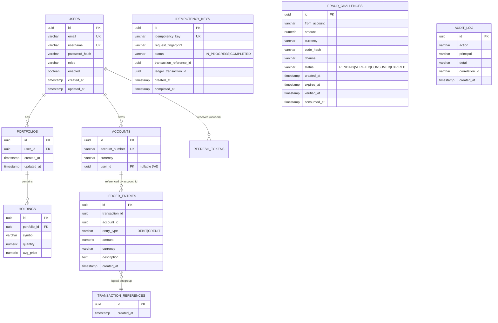

# VaultCore Financial — Database Design

> Derived from Flyway migrations `src/main/resources/db/migration/V1__…V10__`. Database:
> **PostgreSQL 15**. Schema is managed exclusively by Flyway; Hibernate runs with
> `ddl-auto: validate` (entities must match the migrated schema).

---

## 1. Entity-Relationship Diagram



---

## 2. Migration Inventory

| Migration | Purpose |
|---|---|
| `V1__create_ledger_schema.sql` | `ledger_entries` + immutability trigger + deferred double-entry trigger + CHECK constraints + indexes |
| `V2__create_users.sql` | `users` + unique indexes + `updated_at` trigger |
| `V3__create_refresh_tokens.sql` | `refresh_tokens` (**reserved — no application code uses it**; refresh is via Keycloak) |
| `V4__create_accounts_transaction_references.sql` | `accounts`, `transaction_references` |
| `V5__create_portfolio_tables.sql` | `portfolios`, `holdings` |
| `V6__add_account_user_relation.sql` | `accounts.user_id` FK → `users` (account ownership) |
| `V7__create_idempotency_keys.sql` | `idempotency_keys` + UNIQUE index + status CHECK |
| `V8__create_fraud_challenges.sql` | `fraud_challenges` + status CHECK + index |
| `V9__ledger_statement_index.sql` | composite index `ledger_entries(account_id, created_at)` |
| `V10__create_audit_log.sql` | `audit_log` + indexes |

> Flyway migrations are **append-only** and never modified once applied. `V3` is retained (not deleted)
> to preserve migration history integrity even though it is currently unused.

---

## 3. The Ledger (core invariant)

`ledger_entries` is the system of record. There is **no stored balance column** — balance is derived by
summing entries (`SUM(CREDIT) − SUM(DEBIT)`), which eliminates balance-drift bugs.

**Columns**

| Column | Type | Constraint |
|---|---|---|
| `id` | UUID | PK, default `gen_random_uuid()` |
| `transaction_id` | UUID | NOT NULL (groups the debit+credit of one transfer) |
| `account_id` | UUID | NOT NULL |
| `entry_type` | VARCHAR(6) | CHECK `IN ('DEBIT','CREDIT')` |
| `amount` | NUMERIC(19,4) | CHECK `> 0` |
| `currency` | VARCHAR(3) | NOT NULL |
| `description` | TEXT | |
| `created_at` | TIMESTAMP | NOT NULL default `NOW()` |

**Indexes:** `idx_ledger_entries_account_id`, `idx_ledger_entries_transaction_id`, and the composite
`idx_ledger_entries_account_created (account_id, created_at)` for statement range scans and balance reads.

### Immutability trigger

```sql
CREATE TRIGGER trg_ledger_entries_no_update
BEFORE UPDATE OR DELETE ON ledger_entries
FOR EACH ROW EXECUTE FUNCTION ledger_entries_immutable();  -- RAISE EXCEPTION
```

Any `UPDATE`/`DELETE` raises `Ledger entries are immutable`. Verified by `LedgerImmutabilityIT`.

### Deferred double-entry validation trigger

```sql
CREATE CONSTRAINT TRIGGER trg_validate_double_entry
AFTER INSERT ON ledger_entries
DEFERRABLE INITIALLY DEFERRED
FOR EACH ROW EXECUTE FUNCTION validate_double_entry();
```

At commit, for each `transaction_id` it enforces: **≥ 2 entries** and **Σ DEBIT = Σ CREDIT**. Verified
by `LedgerDoubleEntryIT`. Application code (`LedgerService.validateDoubleEntry`) enforces the same
invariant as defense-in-depth.

---

## 4. Idempotency Table

```sql
CREATE TABLE idempotency_keys (
    id UUID PRIMARY KEY DEFAULT gen_random_uuid(),
    idempotency_key VARCHAR(200) NOT NULL,
    request_fingerprint VARCHAR(128) NOT NULL,     -- SHA-256 of canonical request
    status VARCHAR(20) NOT NULL,                    -- IN_PROGRESS | COMPLETED
    transaction_reference_id UUID,
    ledger_transaction_id UUID,
    created_at TIMESTAMP NOT NULL DEFAULT NOW(),
    completed_at TIMESTAMP
);
CREATE UNIQUE INDEX idx_idempotency_key ON idempotency_keys(idempotency_key);  -- concurrency arbiter
```

The UNIQUE index guarantees at most one execution per key even under simultaneous duplicate requests.

---

## 5. Fraud Challenges Table

```sql
CREATE TABLE fraud_challenges (
    id UUID PRIMARY KEY DEFAULT gen_random_uuid(),
    from_account VARCHAR(32) NOT NULL,
    amount NUMERIC(19,4) NOT NULL,
    currency VARCHAR(3) NOT NULL,
    code_hash VARCHAR(128) NOT NULL,               -- BCrypt hash of the 6-digit code
    channel VARCHAR(40) NOT NULL,
    status VARCHAR(20) NOT NULL,                    -- CHECK PENDING|VERIFIED|CONSUMED|EXPIRED
    created_at TIMESTAMP NOT NULL DEFAULT NOW(),
    expires_at TIMESTAMP NOT NULL,
    verified_at TIMESTAMP, consumed_at TIMESTAMP
);
CREATE INDEX idx_fraud_challenges_from_account ON fraud_challenges(from_account);
```

Codes are never stored in the clear — only a BCrypt hash is persisted.

---

## 6. Audit Log Table

```sql
CREATE TABLE audit_log (
    id UUID PRIMARY KEY DEFAULT gen_random_uuid(),
    action VARCHAR(60) NOT NULL,           -- e.g. TRANSFER_EXECUTED, FRAUD_CHALLENGE_VERIFIED
    principal VARCHAR(200),
    detail VARCHAR(1000),
    correlation_id VARCHAR(64),            -- ties to X-Correlation-Id
    created_at TIMESTAMP NOT NULL DEFAULT NOW()
);
CREATE INDEX idx_audit_log_created ON audit_log(created_at);
CREATE INDEX idx_audit_log_principal ON audit_log(principal);
```

Writes are best-effort (never break the business operation) and carry the request's correlation ID.

---

## 7. Users, Accounts, Portfolio

- **`users`**: unique `email` + `username`; `password_hash` (BCrypt); `updated_at` maintained by trigger.
- **`accounts`**: unique `account_number`; `CHECK char_length(currency)=3`; nullable `user_id` FK (V6)
  — unowned accounts (e.g. system/clearing) are permitted, owned accounts enable IDOR protection.
- **`portfolios`** 1‑N **`holdings`**; `holdings` has `UNIQUE(portfolio_id, symbol)`.

---

## 8. Transaction & Isolation Model

| Aspect | Setting |
|---|---|
| Transfer isolation | `@Transactional(isolation = SERIALIZABLE, propagation = REQUIRES_NEW)` |
| Row locking | `@Lock(PESSIMISTIC_WRITE)` on `findByAccountNumberForUpdate`, locked in deterministic order |
| Serialization conflict | Retried on SQLSTATE `40001` / `CannotAcquireLockException` (backoff + jitter, ≤ 30 attempts) |
| Double-entry check | deferred constraint trigger (at commit) |
| Idempotency / audit / fraud writes | `REQUIRES_NEW` (independent commit) |
| Two DBs | Application DB (`vaultcore`) and Keycloak DB (`keycloak_db`) on the same PostgreSQL instance, separate owners |

---

## 9. Data Integrity Summary

| Guarantee | Enforced by |
|---|---|
| Ledger append-only | DB trigger + JPA `@Immutable`/`updatable=false` |
| Money conserved | deferred double-entry trigger + app validation |
| Positive amounts, valid types | CHECK constraints |
| No negative balance | application check (`InsufficientFundsException`) inside the serialized, locked tx |
| Exactly-once transfer per key | UNIQUE idempotency index |
| Account ownership | `accounts.user_id` FK + owner-scoped query |

---

### Document Control

| Field | Value |
|---|---|
| ✔ Document Status | **Approved — reflects V1–V10 migrations** |
| ✔ Last Reviewed | 2026-07-10 |
| ✔ Version | 1.0.0 |
| ✔ Related Documents | [01_Enterprise_Architecture](01_Enterprise_Architecture.md), [02_Software_Design_Document](02_Software_Design_Document.md), [05_Security_Assessment](05_Security_Assessment.md) |
