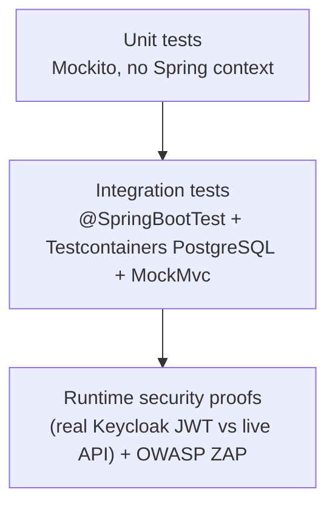

# VaultCore Financial — Test Strategy & Coverage

> Reflects the suites under `src/test/java/**` and `docker/mock-stock-api/test/**`. All figures are from
> an actual `./mvnw clean verify` run against Testcontainers PostgreSQL 15.

---

## 1. Testing Pyramid

- **Unit (fast, no Docker):** `FraudDetectionServiceTest`, `AccountOwnershipServiceTest`,
  `LedgerServiceTest`, `StockPriceClientTest`.
- **Integration (Testcontainers PostgreSQL 15):** ledger immutability/double-entry/concurrency,
  transfer authorization + idempotency, fraud flow, portfolio, statements, OAuth2, audit.
- **Runtime / security:** real-token API probes + OWASP ZAP baseline (see
  [06_OWASP_ZAP_Report.md](06_OWASP_ZAP_Report.md)).

---

## 2. Result Summary (latest `mvn clean verify`)

| Metric | Value |
|---|---|
| Total tests | **35** |
| Failures / Errors / Skipped | **0 / 0 / 0** |
| Build | **BUILD SUCCESS** |
| Instruction coverage (JaCoCo) | **73.9%** |
| Line coverage | **76.9%** |
| Branch coverage | **48.3%** |

---

## 3. Suite Inventory

| Suite | Type | Verifies |
|---|---|---|
| `LedgerImmutabilityIT` | IT | Raw `UPDATE`/`DELETE` on `ledger_entries` throw `DataAccessException` |
| `LedgerDoubleEntryIT` | IT | Unbalanced/single entries rejected at commit; balanced pass |
| `LedgerConcurrencyIT` | IT | Concurrent `recordTransaction` calls do not error |
| `TransferServiceConcurrencyIT` | IT | **100 concurrent** transfers from one account → correct, non-negative, funds conserved |
| `TransferAuthorizationIT` | IT (MockMvc) | 401 unauth · 403 IDOR · 201 owned · idempotency replay executes once |
| `FraudChallengeFlowIT` | IT (MockMvc + OutputCapture) | challenge → verify (real code) → resubmit → success |
| `FraudDetectionServiceTest` | Unit (Mockito) | threshold gate + verified-challenge bypass |
| `AccountOwnershipServiceTest` | Unit (Mockito) | ownership allow/deny (`AccessDeniedException`) |
| `LedgerServiceTest` | Unit | rejects single/imbalanced entries |
| `StockPriceClientTest` | Unit | caching + timeout fallback |
| `PortfolioServiceTest` / `PortfolioControllerIT` | Unit/IT | portfolio logic + endpoints (mock stock server) |
| `StatementServiceTest` / `StatementControllerIT` | Unit/IT | statement generation + endpoint |
| `OAuth2UnauthorizedIT` | IT | unauthenticated protected request → 401 |
| `AuditAspectTest` | IT | audit aspect logs method + duration |
| `stock-api.test.js` | Node | mock API endpoints, `<300ms` latency, determinism |

---

## 4. Techniques

| Technique | Usage |
|---|---|
| **Testcontainers** | `IntegrationTestBase` starts `postgres:15`; `@DynamicPropertySource` wires the datasource; L2 cache / Redis / rate-limit disabled in tests |
| **MockMvc** | `TransferAuthorizationIT`, `FraudChallengeFlowIT` — through the real security filter chain |
| **Mockito** | pure unit tests (no Spring context, no Docker) |
| **Test security** | `TestSecurityConfig` provides a mock `JwtDecoder` (maps bearer → `preferred_username`); the **production** security filter chain is active in tests (only the real Keycloak decoder is `@Profile("!test")`) |
| **Output capture** | `FraudChallengeFlowIT` recovers the delivered mock 2FA code from logs to complete verification |

---

## 5. Concurrency Test (the crown jewel)

`TransferServiceConcurrencyIT` launches **100** virtual threads transferring from the same account and
asserts: final sender balance == expected, `>= 0`, and total funds conserved. This is the spec's
Week‑2 review criterion, proven against real PostgreSQL with `SERIALIZABLE` + pessimistic locks +
serialization-conflict retry.

---

## 6. Fraud Test (end-to-end)

`FraudChallengeFlowIT`: a `>= 10,000` transfer returns `403 fraud_challenge_required`; the test extracts
the mock code, calls the verify endpoint, then resubmits with `X-Fraud-Challenge-Id` and asserts `201`.
Proves the challenge is a real second factor with a completion path, not a permanent block.

---

## 7. Performance / Latency

- Stock price path bounded by a 250 ms client timeout + 2 s cache; the mock API's own test asserts
  `<300ms` server latency (`stock-api.test.js`).
- Balance reads use a dedicated virtual-thread executor.

> A dedicated JMH/Gatling load suite is **not** implemented (future work); the concurrency IT is the
> current correctness-under-load evidence.

---

## 8. CI Execution

`.github/workflows/ci.yml` runs, on every push/PR to `main`:
- **backend** — `./mvnw -B verify` (Testcontainers on the runner's Docker) + JaCoCo (coverage artifact);
- **frontend** — `npm ci`, `npm run lint`, `npm run build`;
- **image-scan** — Trivy scan of the backend image (report-only);
- **codeql** — static analysis for Java + JavaScript.

> The workflow is authored and every step's command is locally verified (`mvn verify`, `npm lint/build`,
> `docker build` all pass locally). The GitHub Actions execution itself runs on push — *verified in
> code/locally; the hosted pipeline run is observed only after a push.*

---

## 9. Future Testing

1. Authenticated **active** OWASP ZAP scan with a session context.
2. Load/perf suite (Gatling/JMH) for the balance and transfer paths.
3. Raise branch coverage (currently 48%) on error/retry branches.
4. Contract tests for the stock API client.

---

### Document Control

| Field | Value |
|---|---|
| ✔ Document Status | **Approved — reflects latest `mvn verify`** |
| ✔ Last Reviewed | 2026-07-10 |
| ✔ Version | 1.0.0 |
| ✔ Related Documents | [06_OWASP_ZAP_Report](06_OWASP_ZAP_Report.md), [02_Software_Design_Document](02_Software_Design_Document.md) |
