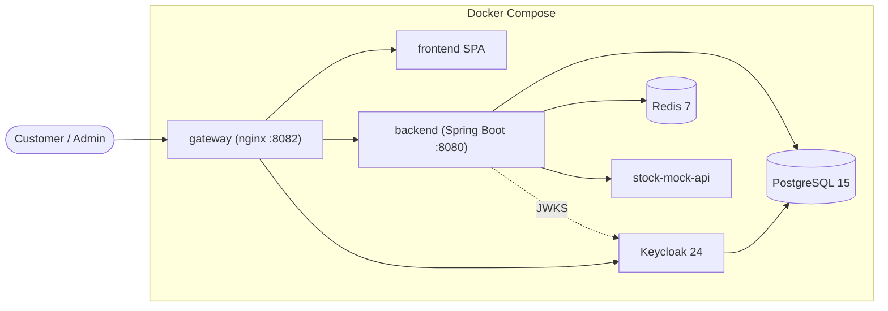

# VaultCore Financial — Documentation Portal

[](https://github.com/mkarthik2006/vaultcore-financial/actions/workflows/ci.yml)


> **VaultCore Financial** is an enterprise-grade digital-banking core (Zaalima "Q4 High-Performance
> Java", Project 1 — FinTech). This portal is the single entry point to the full documentation suite.
> Every document reflects the **current implementation** and is backed by runtime evidence
> (35/35 tests, healthy `docker compose` stack, OWASP ZAP 0 High/Critical, live real-JWT security proofs).

---

## 1. Documentation Overview

The suite is organized as ten numbered documents. Read them in order for a full picture, or jump to a
topic using the navigation table below.

| # | Document | What it answers |
|---|---|---|
| 01 | [Enterprise Architecture](01_Enterprise_Architecture.md) | What is the system, how do its parts fit, how do requests/auth/transfers/fraud/idempotency flow? |
| 02 | [Software Design Document](02_Software_Design_Document.md) | How is the code structured — packages, patterns, layering, exception/validation design? |
| 03 | [API Reference](03_API_Reference.md) | Every REST endpoint: URIs, auth, headers, request/response, errors, examples. |
| 04 | [Database Design](04_Database_Design.md) | ERD, all V1–V10 tables/constraints/triggers/indexes, transaction & isolation model. |
| 05 | [Security Assessment](05_Security_Assessment.md) | Threat model, OWASP Top 10, IDOR/RBAC/JWT, residual risks, verification evidence. |
| 06 | [OWASP ZAP Report](06_OWASP_ZAP_Report.md) | The actual baseline scan: results, remediation, accepted risks. |
| 07 | [Test Strategy & Coverage](07_Test_Strategy_and_Coverage.md) | Testing pyramid, suite inventory, coverage, CI execution. |
| 08 | [Deployment Guide](08_Deployment_Guide.md) | Prerequisites, `.env`, build/run/verify/rollback, troubleshooting. |
| 09 | [Operations Runbook](09_Operations_Runbook.md) | Daily ops, backup/restore, incident response, DR. |
| 10 | [Release Notes v1.0.0](10_Release_Notes_v1.0.0.md) | Features, improvements, known limitations, migration notes. |

> Supplementary evidence docs also live here: [COMPLIANCE_EVIDENCE.md](COMPLIANCE_EVIDENCE.md),
> [SECURITY_VALIDATION.md](SECURITY_VALIDATION.md), [RUNBOOK.md](RUNBOOK.md) (quick reference).
> Raw OWASP ZAP artifacts: [`../security/zap/`](../security/zap/).

---

## 2. Recommended Reading Order

```mermaid
graph LR
    A[01 Architecture] --> B[02 Software Design]
    B --> C[03 API Reference]
    C --> D[04 Database Design]
    D --> E[05 Security Assessment]
    E --> F[06 OWASP ZAP]
    F --> G[07 Test Strategy]
    G --> H[08 Deployment]
    H --> I[09 Operations Runbook]
    I --> J[10 Release Notes]
```



- **Architects / reviewers:** 01 → 04 → 05 → 06.
- **Backend engineers:** 02 → 03 → 04 → 07.
- **DevOps / SRE:** 08 → 09 → 01.
- **Security reviewers:** 05 → 06 → 03.

---

## 3. Architecture at a Glance



Full diagrams (container, component, deployment, and all flow sequences) are in
[01_Enterprise_Architecture.md](01_Enterprise_Architecture.md); the ER diagram is in
[04_Database_Design.md](04_Database_Design.md).

---

## 4. Project Status

| Aspect | Status | Evidence |
|---|---|---|
| Build | ✅ Passing | `./mvnw clean verify` → BUILD SUCCESS |
| Automated tests | ✅ 35 / 35 | Testcontainers PostgreSQL 15 |
| Coverage (JaCoCo) | 76.9% lines · 73.9% instr · 48.3% branch | `target/site/jacoco` |
| Docker deployment | ✅ Healthy | `docker compose up` — all healthchecked services healthy |
| OWASP ZAP baseline | ✅ 0 High / 0 Critical | [`security/zap/`](../security/zap/) |
| Runtime security proofs | ✅ IDOR 403 · RBAC 403 · JWT validation | live stack, real Keycloak token |
| Hosted CI (GitHub Actions) | ✅ Passing | [PR #16](https://github.com/mkarthik2006/vaultcore-financial/pull/16) — backend `mvn verify`, frontend lint/build, Trivy, CodeQL (all green) |

**Production-readiness:** **Enterprise Ready** — the GitHub Actions pipeline (build, 35 tests on
Testcontainers, Trivy, CodeQL) passes on the pull request. One documented production follow-up remains:
rotate the Keycloak DB secret from a secret manager. See
[10_Release_Notes_v1.0.0.md](10_Release_Notes_v1.0.0.md#9-known-limitations).

---

## 5. Quick Start

```bash
cp .env.example .env      # or create .env per the Deployment Guide
docker compose up -d --build
curl -s http://localhost:8082/health.json     # {"status":"UP"}
```

Full instructions: [08_Deployment_Guide.md](08_Deployment_Guide.md).

---

| Field | Value |
|---|---|
| **Version** | 1.0.0 (Enterprise Edition) |
| **Last updated** | 2026-07-10 |
| **Branch** | `feature/enterprise-hardening` |
| **Maintainer** | Karthik Muthuirulappan |
