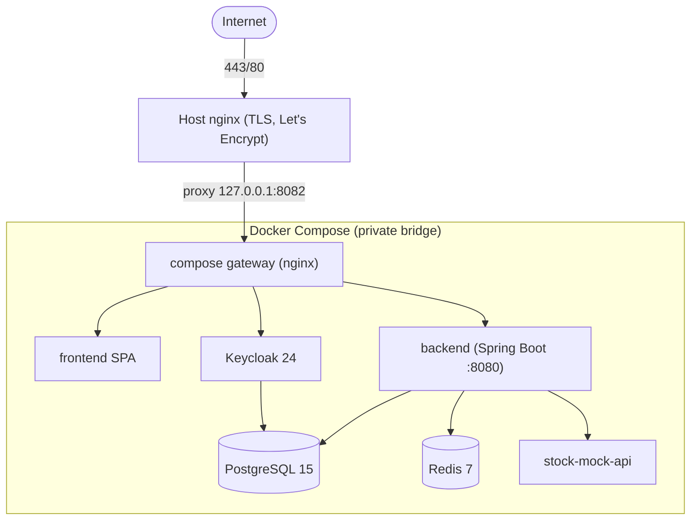

# VaultCore Financial — Oracle Cloud (Always Free) Deployment Guide

> Deploys the **entire** stack (frontend, backend, PostgreSQL, Redis, Keycloak, internal nginx gateway)
> to a **single** Oracle Cloud Ampere A1 (ARM64) Always-Free VM, fronted by a host nginx that terminates
> **Let's Encrypt HTTPS**. All artifacts referenced here live under [`deploy/`](../../deploy/).
>
> **Scope note:** these are the exact, reproducible steps to run against **your** OCI account and VM.
> The account, VM, and DNS are provisioned by you in the OCI console (they require identity/payment
> verification); every command below then runs on that VM.

---

## Server Architecture



- **One published surface:** UFW allows only `22/80/443`. The compose gateway binds to `127.0.0.1:8082`
  (not the internet); Redis/stock ports are not published at all.
- **ARM64:** every image used is multi-arch (postgres, redis, `quay.io/keycloak/keycloak`, nginx, node,
  eclipse-temurin/maven); the backend/frontend/mock build from source natively on the A1.

---

## Step 0 — Prerequisites you provide

| Item | Notes |
|---|---|
| Oracle Cloud account | Always Free tier; complete signup + card verification at cloud.oracle.com |
| Domain (optional) | e.g. `vaultcore.example.com` → A record to the VM's public IP. No domain? Use `nip.io` (e.g. `<dashed-ip>.nip.io`). HTTPS needs a resolvable name. |
| SSH keypair | `ssh-keygen -t ed25519 -f ~/.ssh/oci_vaultcore` |

---

## Step 1 — Create the Always-Free VM

**Purpose:** provision the compute that runs everything.

**Steps (OCI Console):** Compute → Instances → *Create instance*.
- **Image:** Canonical **Ubuntu 24.04** (Minimal is fine).
- **Shape:** *Ampere* → **VM.Standard.A1.Flex** → **4 OCPU / 24 GB** (Always Free eligible).
- **SSH keys:** upload `~/.ssh/oci_vaultcore.pub`.
- **Networking:** create a new VCN with an Internet Gateway (wizard default), assign a **public IPv4**.
- **Boot volume:** default (up to 200 GB Always Free across volumes).

**Expected output:** instance state `Running` with a public IP.

**Verification:** the instance detail page shows a public IPv4.

**Common errors & fixes**
- *"Out of host capacity" for A1 shape* → A1 free capacity is region-constrained. Retry in another
  Availability Domain, or another region, or use OCI's *"Always Free"* home-region; a small retry loop
  (or trying at off-peak hours) usually succeeds.

---

## Step 2 — Networking: VCN, subnet, security list, ports

**Purpose:** allow inbound HTTP/HTTPS/SSH from the internet; everything else stays closed.

**Steps (OCI Console):** Networking → Virtual Cloud Networks → your VCN → *Security Lists* → default →
*Add Ingress Rules* (Source `0.0.0.0/0`, IP Protocol TCP):

| Port | Purpose |
|---|---|
| 22 | SSH |
| 80 | HTTP (ACME challenge + redirect) |
| 443 | HTTPS |

> Do **not** open 8080/8443/8761/9000/6379/8082 to the internet — the app is reached only via 443.
> The VCN also needs an **Internet Gateway** and a route `0.0.0.0/0 → Internet Gateway` (the create-VM
> wizard adds these; verify under *Route Tables*).

**Verification:** Security List shows the three ingress rules; Route Table has the `0.0.0.0/0` route.

**Common errors & fixes**
- *Can't SSH / site unreachable although app is up* → OCI security list is the #1 cause; confirm the
  three rules exist. OCI security lists are **in addition** to the VM's UFW.

---

## Step 3 — Connect + provision the OS

**Purpose:** install Docker, nginx, certbot, firewall, fail2ban, SSH hardening, swap.

```bash
ssh -i ~/.ssh/oci_vaultcore ubuntu@<PUBLIC_IP>
# on the VM:
sudo apt-get update -y && sudo apt-get install -y git
git clone https://github.com/mkarthik2006/vaultcore-financial.git
cd vaultcore-financial
git checkout feature/enterprise-hardening   # or main, once merged
bash deploy/scripts/provision.sh
exit   # log out/in so your user joins the 'docker' group
```

**What `provision.sh` does:** installs Docker Engine + Compose plugin (arm64 repo), OpenJDK 21, nginx,
certbot, UFW (allow 22/80/443 only), fail2ban, unattended-upgrades, a 4 GB swapfile, disables SSH root
login + password auth, and creates `/var/www/certbot`.

**Expected output:** `Provisioning complete.` and the NEXT checklist.

**Verification**
```bash
docker --version && docker compose version
sudo ufw status            # 22/80/443 ALLOW; default deny
free -h                    # shows 24G RAM + 4G swap
```

**Common errors & fixes**
- *`docker: permission denied`* → you didn't re-login after the `usermod -aG docker`. Log out/in (or
  `newgrp docker`).
- *Keycloak later OOM-killed / "Killed"* → give the VM real memory (A1 24 GB is ample) **and** keep the
  4 GB swap. This exact symptom appears on undersized hosts; on the A1 it does not occur.

---

## Step 4 — Configure the environment (`.env`)

**Purpose:** set domain, secrets, and the **issuer/hostname alignment** that makes login work.

```bash
cp deploy/env/.env.prod.example .env
# generate strong secrets:
sed -i "s/CHANGE_ME_strong_db_password/$(openssl rand -base64 24)/"     .env
sed -i "s/CHANGE_ME_strong_admin_password/$(openssl rand -base64 24)/"  .env
sed -i "s/CHANGE_ME_strong_kc_db_password/$(openssl rand -base64 24)/"  .env
# set your domain everywhere:
export DOMAIN=vaultcore.example.com
sed -i "s/vaultcore.example.com/$DOMAIN/g" .env
```

> **The single most important production detail for this app:** the frontend, Keycloak, and the backend
> must all agree on the token **issuer**. The template wires them consistently under `/auth`:
> - `KC_HOSTNAME_URL = https://<domain>/auth`
> - `OAUTH2_ISSUER_URI = https://<domain>/auth/realms/vaultcore`
> - `VITE_KEYCLOAK_URL = https://<domain>/auth`, `VITE_API_BASE_URL = https://<domain>`
>
> Because host nginx sends `X-Forwarded-Proto https` and Keycloak runs with `KC_PROXY_HEADERS=xforwarded`,
> the realm's `sslRequired=external` is satisfied — no need to weaken SSL settings.

**Also update the Keycloak realm client** so it accepts the public URLs. Edit
`docker/keycloak/realm-import/realm-export.json` **before the first start** (or via the admin console
after), setting on client `vaultcore-frontend`:
- `redirectUris`: `["https://<domain>/*"]`
- `webOrigins`: `["https://<domain>"]`

```bash
sed -i "s#http://localhost:8082#https://$DOMAIN#g" docker/keycloak/realm-import/realm-export.json
```

**Verification:** `grep -E "DOMAIN|ISSUER|VITE_" .env` shows your domain; `grep redirectUris -n`
in the realm export shows the https origin.

---

## Step 5 — TLS certificate (Let's Encrypt)

**Purpose:** issue certs before nginx serves 443.

```bash
# 1) point DNS A record for $DOMAIN at the VM's public IP first (verify: dig +short $DOMAIN)
# 2) temporary HTTP server for the ACME challenge via certbot standalone:
sudo systemctl stop nginx 2>/dev/null || true
sudo certbot certonly --standalone -d "$DOMAIN" --agree-tos -m you@example.com --non-interactive
```

**Expected output:** `Successfully received certificate` and paths under
`/etc/letsencrypt/live/$DOMAIN/`.

**Verification:** `sudo ls /etc/letsencrypt/live/$DOMAIN/` shows `fullchain.pem` + `privkey.pem`.

**Auto-renewal:** the certbot systemd timer renews automatically; add a reload hook:
```bash
echo -e '#!/bin/sh\nsystemctl reload nginx' | sudo tee /etc/letsencrypt/renewal-hooks/deploy/reload-nginx.sh
sudo chmod +x /etc/letsencrypt/renewal-hooks/deploy/reload-nginx.sh
sudo certbot renew --dry-run   # verify renewal works
```

**Common errors & fixes**
- *`Timeout / connection refused` during challenge* → port 80 blocked. Confirm OCI security list **and**
  UFW allow 80, and DNS resolves to this VM.

---

## Step 6 — Host nginx (TLS reverse proxy)

**Purpose:** terminate HTTPS and forward to the internal gateway.

```bash
sudo cp deploy/nginx/vaultcore.conf /etc/nginx/sites-available/vaultcore.conf
sudo sed -i "s/vaultcore.example.com/$DOMAIN/g" /etc/nginx/sites-available/vaultcore.conf
sudo ln -sf /etc/nginx/sites-available/vaultcore.conf /etc/nginx/sites-enabled/
sudo rm -f /etc/nginx/sites-enabled/default
sudo nginx -t && sudo systemctl enable --now nginx && sudo systemctl reload nginx
```

**Expected output:** `nginx: configuration file ... test is successful`.

**Verification:** `curl -I http://$DOMAIN` → `301` to https; `curl -I https://$DOMAIN` → `200`/`404`
(the app isn't up yet — that's next).

---

## Step 7 — Deploy the stack

**Purpose:** build ARM images and start all services with the production overrides.

```bash
bash deploy/scripts/deploy.sh
```

`deploy.sh` runs `docker compose -f docker-compose.yml -f deploy/docker-compose.prod.yml up -d --build`,
waits for the gateway `health.json` to report `UP`, and **rolls back** to the previous commit/images if
the new build is unhealthy. First run takes several minutes (Keycloak import + backend Flyway).

**Expected output:** `Deploy healthy.` followed by `docker compose ps` with all healthchecked services
`healthy`.

**Verification**
```bash
docker compose -f docker-compose.yml -f deploy/docker-compose.prod.yml ps
curl -s http://127.0.0.1:8082/health.json          # {"status":"UP"}
curl -s -o /dev/null -w "%{http_code}\n" https://$DOMAIN/api/v1/portfolio   # 401 (expected)
curl -s -o /dev/null -w "%{http_code}\n" "https://$DOMAIN/auth/realms/vaultcore/.well-known/openid-configuration"  # 200
```

**Common errors & fixes**
- *Login redirects to `http://vaultcore-keycloak:8080`* → `KC_HOSTNAME_URL` not set to the public
  `https://<domain>/auth`. Fix `.env`, `docker compose ... up -d keycloak --force-recreate`.
- *Backend returns `401` for a freshly-issued token* → issuer mismatch. Decode the token
  (`cut -d. -f2 | base64 -d`), compare `iss` to `OAUTH2_ISSUER_URI`; they must be identical.
- *`invalid_redirect_uri` on login* → realm client `redirectUris`/`webOrigins` don't include
  `https://<domain>` (Step 4).
- *Keycloak `permission denied for schema public`* → only on a stale DB volume; this repo's init script
  already fixes PG15 ownership. For a truly fresh start: `docker compose ... down -v` then redeploy.

---

## Step 8 — Final Verification (go-live checklist)

| Check | Command / action | Expected |
|---|---|---|
| Application loads | open `https://<domain>` | React login page |
| HTTPS works | `curl -I https://<domain>` | `200`, valid cert, HSTS header |
| Login works | click "Login with Keycloak" → sign in | redirected back authenticated |
| Database connected | `docker logs vaultcore-app \| grep -i flyway` | migrations applied |
| Redis connected | backend healthy; cache active | no Redis errors in logs |
| Keycloak connected | OIDC discovery `200` (above) | issuer = your domain |
| Transfers work | POST `/api/v1/transfers` for an owned account | `201` |
| Fraud detection | transfer ≥ 10,000 | `403 fraud_challenge_required` |
| Health endpoint | `curl https://<domain>/api/actuator/health` | `{"status":"UP"}` |
| Docker healthy | `docker compose ... ps` | all `healthy` |

> A logged-in customer needs a **provisioned, owned account**: an ADMIN calls
> `POST /api/v1/admin/users` then `POST /api/v1/admin/accounts` with `ownerUsername` (see
> [../03_API_Reference.md](../03_API_Reference.md)).

---

## Security Hardening (applied by `provision.sh`)

| Control | Detail |
|---|---|
| Firewall | UFW default-deny; only 22/80/443 open. OCI security list mirrors this. |
| SSH | key-only, root login disabled, password auth disabled. |
| fail2ban | sshd jail enabled. |
| Auto-updates | unattended security upgrades. |
| Docker | `restart: unless-stopped` on all services; log rotation (10m×5). |
| TLS | Let's Encrypt + auto-renew; HSTS; TLS 1.2/1.3 only; `server_tokens off`. |
| App-layer | (already in the app) JWT validation, IDOR/RBAC, rate limiting, audit log, security headers. |

---

## Monitoring

```bash
# health
watch -n 30 'docker compose -f docker-compose.yml -f deploy/docker-compose.prod.yml ps'
curl -s https://$DOMAIN/api/actuator/health | jq .
# logs (with correlation IDs)
docker compose -f docker-compose.yml -f deploy/docker-compose.prod.yml logs -f backend | grep correlationId
# disk / memory
df -h /        # boot volume
free -h        # RAM + swap
docker stats --no-stream
```

A lightweight cron alert for disk pressure:
```bash
( crontab -l 2>/dev/null; echo '*/15 * * * * [ $(df / --output=pcent | tr -dc 0-9) -gt 85 ] && logger "VaultCore disk >85%"' ) | crontab -
```

---

## Backup & Disaster Recovery

**Nightly backups** (both databases, 14-day retention):
```bash
( crontab -l 2>/dev/null; echo "0 2 * * * $PWD/deploy/scripts/backup.sh >> /var/log/vaultcore-backup.log 2>&1" ) | crontab -
```

**Restore a database**
```bash
gunzip -c /var/backups/vaultcore/app_YYYY-MM-DD_HHMMSS.sql.gz \
  | docker exec -i vaultcore-db psql -U "$POSTGRES_USER" -d "$POSTGRES_DB"
```

**Full DR from scratch**
1. New VM → Steps 1–6.
2. Restore `db` first: `docker compose ... up -d db`, load both dumps, then `deploy.sh`.
3. The Postgres named volume `vaultcore_pgdata` also survives `docker compose down` (without `-v`); take
   volume snapshots via OCI Block Volume backups for image-level DR.

---

## Performance Tuning (already configured)

| Layer | Setting |
|---|---|
| JVM | `-XX:+UseContainerSupport -XX:MaxRAMPercentage=75` (container-aware heap) |
| Virtual threads | `spring.threads.virtual.enabled=true` + dedicated executor on balance reads |
| PostgreSQL | composite index on `ledger_entries(account_id, created_at)`; JDBC batching |
| Redis | Hibernate L2 region + Spring cache |
| nginx | gzip, keep-alive, large header buffers for Keycloak |
| Docker | log rotation; ARM-native builds |

For heavier load, raise Postgres `shared_buffers`/`max_connections` via a mounted `postgresql.conf` and
pin per-container memory limits.

---

## CI/CD — automated deploy

`.github/workflows/deploy.yml` deploys over SSH (build → health-gate → rollback). Add repo secrets:

| Secret | Value |
|---|---|
| `OCI_HOST` | VM public IP or domain |
| `OCI_SSH_USER` | `ubuntu` |
| `OCI_SSH_KEY` | contents of `~/.ssh/oci_vaultcore` (private key) |
| `OCI_APP_DIR` | `/home/ubuntu/vaultcore-financial` |

Trigger from the Actions tab (*Run workflow*) or by publishing a release. The job runs
`deploy/scripts/deploy.sh`, which rolls back automatically on an unhealthy build.

---

## Upgrade & Rollback

```bash
# upgrade to latest main:
cd ~/vaultcore-financial && bash deploy/scripts/deploy.sh      # auto rollback on failure

# manual rollback to a known-good tag:
git fetch --tags && git checkout v1.0.0
docker compose -f docker-compose.yml -f deploy/docker-compose.prod.yml up -d --build
```

Flyway migrations are **append-only** — never edit V1–V10; roll forward with a new migration. A DB
schema restored from backup must be at the same-or-newer migration version than the running app.

---

## Troubleshooting Quick Reference

| Symptom | Cause | Fix |
|---|---|---|
| 502 from `https://<domain>` | compose gateway not up yet | wait for backend health; `docker compose ... ps` |
| Login loops / wrong redirect | `KC_HOSTNAME_URL` / realm `redirectUris` | Step 4; recreate keycloak |
| 401 with valid token | issuer mismatch | align `OAUTH2_ISSUER_URI` to token `iss` |
| Cert renew fails | port 80 closed | open 80 (OCI + UFW); `certbot renew --dry-run` |
| A1 capacity error | region capacity | retry / other AD / other region |
| Keycloak OOM | undersized host | use A1 24 GB + 4 GB swap |
| Disk full | Docker logs/images | log rotation (set); `docker image prune -f` |

---

### Document Control

| Field | Value |
|---|---|
| ✔ Document Status | **Approved — reproducible deployment; artifacts under `deploy/`** |
| ✔ Last Reviewed | 2026-07-10 |
| ✔ Version | 1.0.0 |
| ✔ Related Documents | [08_Deployment_Guide](../08_Deployment_Guide.md), [09_Operations_Runbook](../09_Operations_Runbook.md), [01_Enterprise_Architecture](../01_Enterprise_Architecture.md) |
